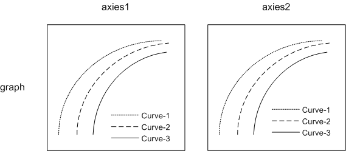

# rd

video rate-distorion assessment

## overview

基本概念：

 - graph = video input  
 - line = x264/x265 preset  
 - point = crf/br point  

 
解释：

 - 一个graph对应一个输入视频，graph由多条曲线（line）构成。
 	* 由于二维曲线职能展示两种属性的关联性。 
 	* 所以一条曲线里面多维度的信息需要分散到多个axies中展示。  
 - 一条曲线对应一种编码方式，需要具体到某个codec的某组参数
 - 一个点对应一次数据搜集（转码），每次数据收集会返回一个n维的向量（br，psnr，ssim，timing，vmaf，crf）。
 - 一个 axies 是所有曲线的一个2d采样，即某两种属性的组合

